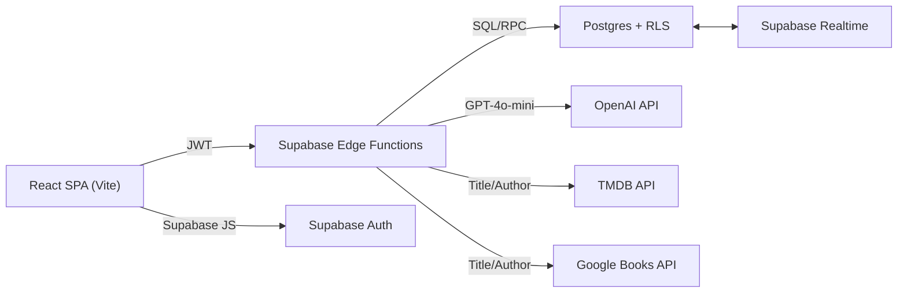
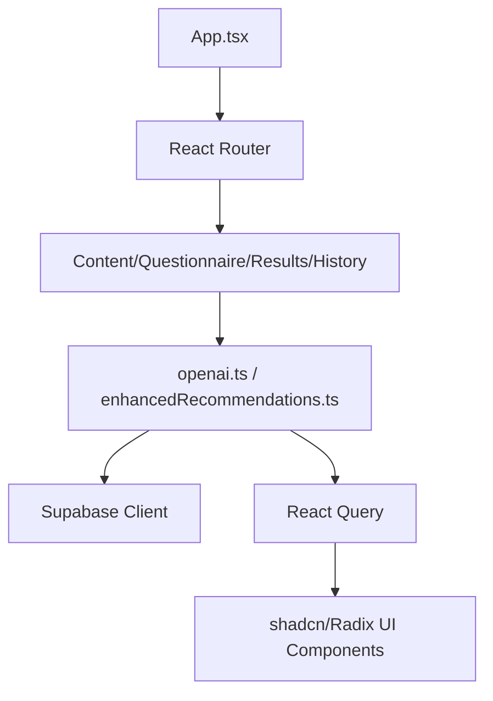
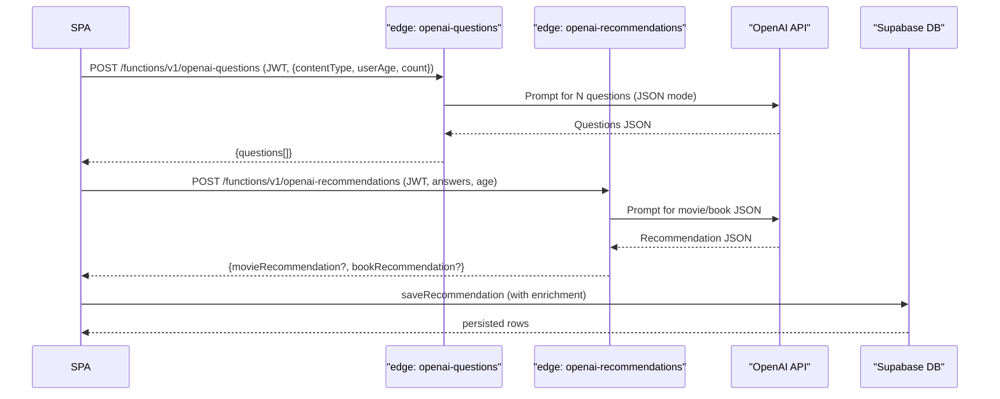
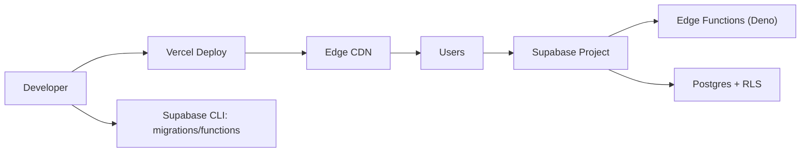
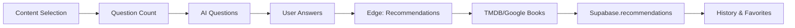

<div align="center">

# Smart Advisor
AI-personalized movie & book recommendations with Supabase auth, OpenAI reasoning, and live enrichment.


</div>

<br/>

## About
Smart Advisor builds age-aware questionnaires, invokes OpenAI for intent understanding, enriches results with TMDB/Google Books metadata, and stores user-specific histories in Supabase with Row Level Security. It is production-minded: JWT-protected Edge Functions, no client-side key exposure, and resilient fallbacks for third-party APIs.

- **What it does**: Auth → personalized questions → AI recommendations → metadata enrichment → saved history/favorites.
- **Who it’s for**: Consumer apps, media platforms, and teams needing secure AI-backed recommendations.
- **Why it matters**: Strong security (RLS/JWT), typed contracts, resilient enrichment, and DX-focused frontend.

## Key Features
- **AI Questionnaire Orchestration** — Generates 3–15 dynamic, age-safe questions via Supabase Edge + GPT-4o-mini.
- **Hybrid Recommendation Engine** — Combines OpenAI reasoning with TMDB/Google Books enrichment while preserving AI explanations.
- **Secure-by-Default Auth** — Supabase PKCE auth, persisted sessions, RLS on profiles/recommendations, verified JWT on protected functions.
- **Resilient Edge Functions** — Deno functions with strict validation, CORS hardening, backoff, and safe defaults when providers fail.
- **History & Favorites** — Persistent recommendation history, filters, favorite toggles, and stats with indexed queries.
- **UX for Retention** — Structured loading states, retry flows, cached sessions, confirm-before-regenerate safeguards.
- **Performance-aware Frontend** — React 18 + Vite, React Query caching, guarded retries, and lazy UI composition.
- **Observability Hooks** — Structured console logging in Edge Functions; global error boundary and env validation in the SPA.

## Tech Stack
**Languages**  
   

**Frontend**  
   

**Backend / Services**  
   

**DevOps / Infra**  
   

**Observability / Security**  
   

## Architecture
- **SPA Frontend**: React 18 + Vite, React Query for server state, `ProtectedRoute`, global error boundary, env validation on boot.
- **Auth & Data**: Supabase Auth (PKCE) + Postgres with RLS on `profiles` and `recommendations`; indexed columns for performance.
- **Edge Functions**: Deno-based Supabase functions for GPT prompts, TMDB proxy, Google Books proxy; JWT required on AI endpoints.
- **AI Orchestration**: GPT-4o-mini for question + recommendation JSON; exponential backoff on the frontend and defaults on functions.
- **Enrichment**: TMDB/Google Books proxies return safe defaults when keys are absent to avoid UX failures.
- **Deployment**: Vercel for SPA, Supabase for DB/Auth/Edge. Env validation protects against missing critical keys.

### System Architecture


### Component Diagram (Frontend)


### API Lifecycle (Questions → Recommendations)


### Deployment Diagram


## Documentation & Deep Examples
**Generate questions (frontend → Edge)**
```ts
import { generateQuestionsWithRetry } from "@/services/openai";

const questions = await generateQuestionsWithRetry("movie", 28, 5);
// -> [{ id, text, content_type, user_age_range }, ...]
```

**Generate and enrich recommendations**
```ts
const recs = await enhancedRecommendationsService.retryRecommendation(
  { answers, contentType: "both", userAge: user.age },
  user.id
);
// AI JSON -> TMDB/Google Books enrichment -> persisted to Supabase
```

**Supabase client bootstrap**
```ts
export const supabase = createClient<Database>(
  import.meta.env.VITE_SUPABASE_URL,
  import.meta.env.VITE_SUPABASE_ANON_KEY,
  { auth: { persistSession: true, flowType: "pkce" } }
);
```

**Edge Function contracts**
- `POST /functions/v1/openai-questions` (JWT) → `{questions[]}`  
  Body: `{ contentType: "movie"|"book"|"both", userAge: 13-120, questionCount: 3-15 }`
- `POST /functions/v1/openai-recommendations` (JWT) → `{ movieRecommendation?, bookRecommendation? }`
- `GET /functions/v1/tmdb-proxy?title=Inception` (public) → `{ poster, year, rating, description }` with safe defaults
- `GET /functions/v1/google-books-proxy?title=Dune&author=Herbert` (public) → `{ cover, year, rating, description }` with safe defaults

**Environment configuration**
| Name | Scope | Description |
| --- | --- | --- |
| VITE_SUPABASE_URL | frontend | Supabase project URL (required) |
| VITE_SUPABASE_ANON_KEY | frontend | Supabase anon key (required) |
| SUPABASE_URL | edge | Supabase project URL |
| SUPABASE_ANON_KEY | edge | Supabase anon key |
| OPENAI_API_KEY | edge | GPT-4o-mini access |
| TMDB_API_KEY | edge | Movie enrichment (optional; defaults exist) |
| GOOGLE_BOOKS_API_KEY | edge | Book enrichment (optional; defaults exist) |

**Data flow (frontend)**


## Getting Started
**Prerequisites**
- Node 18+ (or Bun)
- Supabase project (DB/Auth) + CLI for migrations
- OpenAI API key; optional TMDB/Google Books keys
- Vercel (or static host) for SPA deploy

**Install**
```bash
npm install
# or
bun install
```

**Environment**
```bash
cp .env.example .env.local  # create and populate required keys
# Required (frontend): VITE_SUPABASE_URL, VITE_SUPABASE_ANON_KEY
# Required (edge): SUPABASE_URL, SUPABASE_ANON_KEY, OPENAI_API_KEY
```

**Local development**
```bash
npm run dev
# http://localhost:5173
```

**Supabase migrations (via CLI)**
```bash
supabase db reset            # applies /supabase/migrations/*
supabase functions serve     # local edge testing
```

**Production build**
```bash
npm run build
npm run preview
```

**Deploy**
- SPA: `npm run build` → deploy `dist/` to Vercel (see `vercel.json`).
- Edge Functions: `supabase functions deploy openai-questions openai-recommendations tmdb-proxy google-books-proxy`.
- Env: set all required keys in Vercel + Supabase dashboard.

## API Documentation
| Endpoint | Method | Auth | Purpose |
| --- | --- | --- | --- |
| `/functions/v1/openai-questions` | POST | Bearer (Supabase session) | Generate N personalized questions |
| `/functions/v1/openai-recommendations` | POST | Bearer (Supabase session) | Generate AI recommendations JSON |
| `/functions/v1/tmdb-proxy` | GET | Public | TMDB search with safe fallbacks |
| `/functions/v1/google-books-proxy` | GET | Public | Google Books lookup with safe fallbacks |

**Error handling**
- 400 with `{ error, timestamp }` on validation failures.
- Default media payloads (200) returned when TMDB/Google Books keys are absent to avoid CORS/UX breaks.

**Rate limits**
- Provider limits (OpenAI/TMDB/Google Books) + Supabase org limits. Add gateway-level rate limiting if exposed publicly.

## Project Structure
```
/src
├── pages/                  # Auth, questionnaire, results, history
├── services/               # openai, enrichment, tmdb, googleBooks, database, auth
├── components/             # UI (shadcn/radix), layout, error boundary, protected route
├── hooks/                  # Auth hook, toasts, mobile detection
├── integrations/supabase/  # Supabase client + typed DB
├── utils/                  # Env validation, local storage, helpers
└── types/                  # Shared TypeScript types (DB, domain models)
/supabase
├── functions/              # Deno edge functions (OpenAI, TMDB, Books)
└── migrations/             # Postgres schema, RLS, constraints, indexes
dist/                       # Production build output
```

