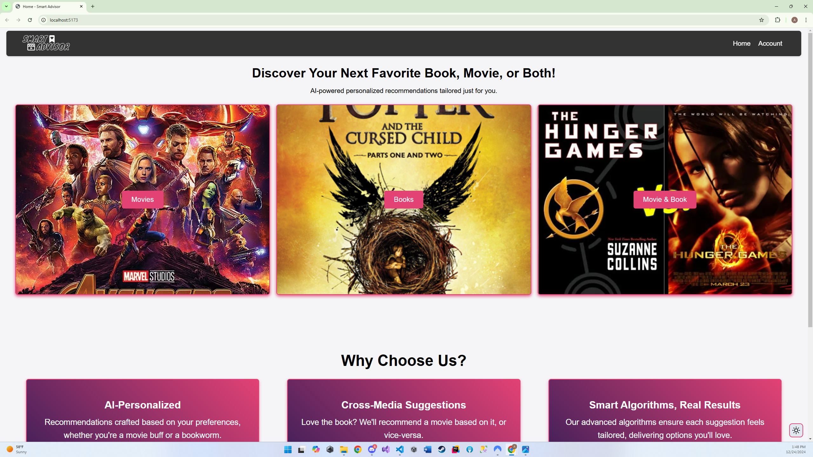
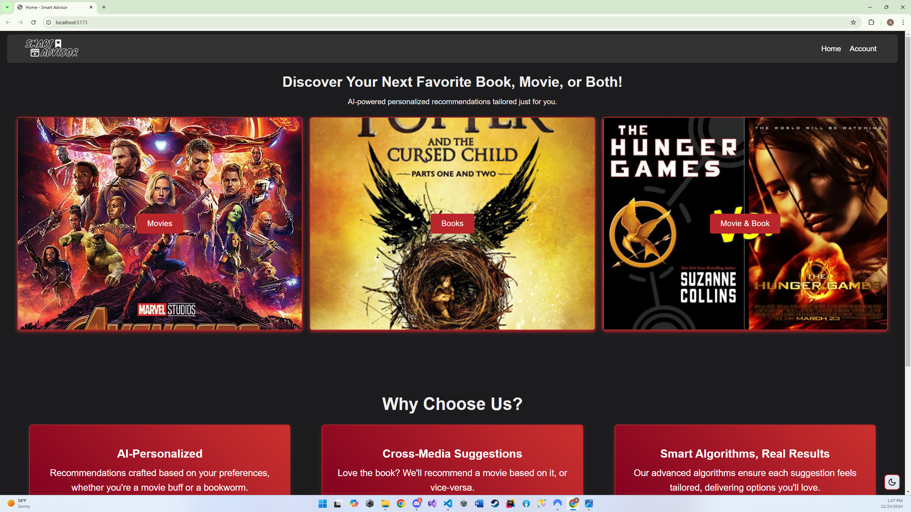
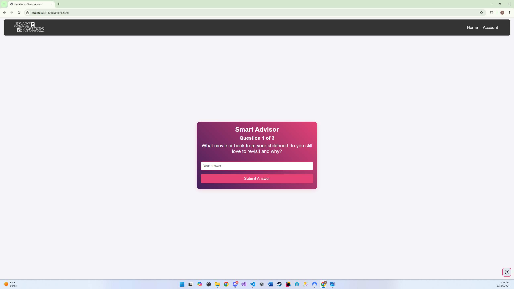
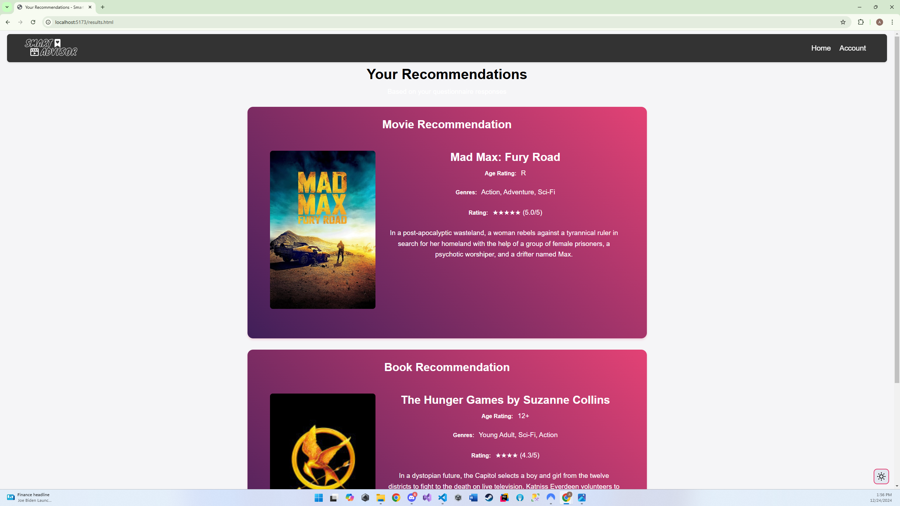

# Smart Advisor - AI-Powered Book & Movie Recommendation System

Smart Advisor is an intelligent recommendation system that provides personalized book and movie suggestions based on user preferences and interests. The system uses AI to analyze user responses to dynamically generated questions and delivers tailored recommendations.

## Features

- **Personalized Recommendations**: Get customized book and movie suggestions based on your responses
- **Flexible Question System**: Choose between 3-15 questions for preference analysis
- **Multiple Recommendation Types**: Request recommendations for:
  - Movies only
  - Books only
  - Combined movie and book recommendations
- **Age-Appropriate Content**: Recommendations are tailored to user's age group
- **User Profiles**: Save recommendations and track your preference history
- **Dark/Light Mode**: Toggle between dark and light themes for comfortable viewing
- **Responsive Design**: Fully functional across desktop and mobile devices

## Interface Preview

### Landing Page - Light Mode


### Landing Page - Dark Mode


### Questionnaire Interface


### Recommendations Display


## Tech Stack

- Frontend: HTML, CSS, JavaScript
- Authentication: Firebase Auth
- Database: Firebase Firestore
- APIs:
  - OpenAI API for recommendation generation
  - TMDB API for movie data
  - Google Books API for book data
- Additional Libraries:
  - Axios for API requests
  - Lodash for data manipulation
  - PapaParse for CSV handling

## Installation

1. Clone the repository
2. Install dependencies:
   ```bash
   npm install
   ```
3. Create a `.env` file in the root directory with the following variables:
   ```
   VITE_FIREBASE_API_KEY=your_firebase_api_key
   VITE_FIREBASE_AUTH_DOMAIN=your_firebase_auth_domain
   VITE_FIREBASE_PROJECT_ID=your_firebase_project_id
   VITE_FIREBASE_STORAGE_BUCKET=your_firebase_storage_bucket
   VITE_FIREBASE_MESSAGING_SENDER_ID=your_firebase_messaging_sender_id
   VITE_FIREBASE_APP_ID=your_firebase_app_id
   VITE_OPENAI_API_KEY=your_openai_api_key
   VITE_TMDB_API_KEY=your_tmdb_api_key
   ```
4. Start the development server:
   ```bash
   npx vite
   ```

## Usage

1. Sign up or log in to access the recommendation system
2. Choose your preferred recommendation type (movies, books, or both)
3. Select the number of questions you'd like to answer (3-15)
4. Answer the AI-generated questions about your preferences
5. Receive personalized recommendations based on your responses
6. View your recommendation history in your account

## Project Structure

```
smart-advisor/
├── css/                  # Stylesheet files
├── js/                   # JavaScript modules
├── images/              # Image assets
└── html/                # HTML pages
```

## Contributing

1. Fork the repository
2. Create a feature branch
3. Commit your changes
4. Push to the branch
5. Open a pull request

## License

This project is part of an academic course and is not licensed for commercial use.